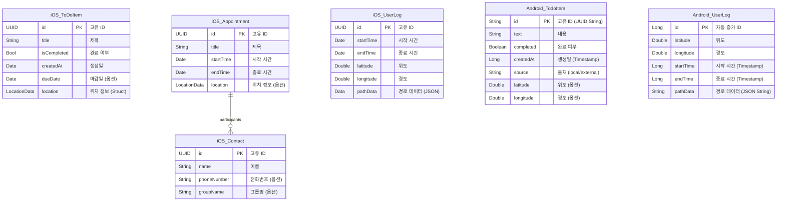

# 데이터 모델 엔티티 관계도 (ERD)

현재 iOS와 Android 애플리케이션의 데이터 구조입니다.

## Mermaid ERD (다이어그램)

## 스키마 상세 설명

### iOS (SwiftData)
- **프레임워크**: SwiftData (`@Model`)
- **주요 타입**:
    - `ToDoItem`: 할 일을 나타냅니다. `LocationData` 구조체를 포함하여 위치를 저장합니다.
    - `Appointment`: 캘린더 일정을 나타내며, `Contact`(참가자)와 연결됩니다.
    - [UserLog](file:///Volumes/Work/AllToDo/AllToDo-Android/app/src/main/java/com/example/alltodo/data/UserLog.kt#6-15): 위치 추적 세션(이동 경로)을 저장합니다.
    - `LocationData`: DB 테이블이 아닌 단순 구조체(Struct)로, 엔티티 안에 임베드되어 저장됩니다.

### Android (Room)
- **프레임워크**: Room Database (`@Entity`)
- **주요 타입**:
    - [TodoItem](file:///Volumes/Work/AllToDo/AllToDo-Android/app/src/main/java/com/example/alltodo/data/TodoItem.kt#7-17): 할 일을 나타냅니다. 위치 정보(`latitude`, `longitude`)를 테이블의 컬럼으로 직접 가집니다. (Null 가능)
    - [UserLog](file:///Volumes/Work/AllToDo/AllToDo-Android/app/src/main/java/com/example/alltodo/data/UserLog.kt#6-15): 이동 경로가 포함된 위치 기록 세션을 나타냅니다.
