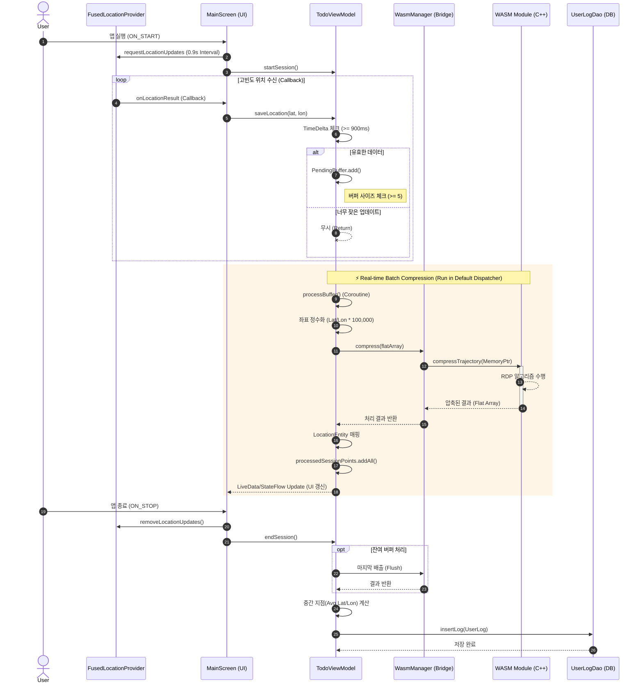

# Android Location Processing Sequence Diagram

AllToDo Android 앱의 **위치 서비스(Service)부터 WASM 압축, ROOM DB 저장까지의 흐름**입니다.
iOS와 달리 `Google Fused Location Provider`와 `ViewModel` 기반으로 동작합니다.

```mermaid
sequenceDiagram
    autonumber
    
    actor User
    participant GMS as FusedLocationProvider
    participant Main as MainScreen (UI)
    participant VM as TodoViewModel
    participant WASM as WasmManager (Bridge)
    participant Core as WASM Module (C++)
    participant Room as UserLogDao (DB)

    User->>Main: 앱 실행 (ON_START)
    Main->>GMS: requestLocationUpdates (0.9s Interval)
    Main->>VM: startSession()

    loop 고빈도 위치 수신 (Callback)
        GMS->>Main: onLocationResult (Callback)
        Main->>VM: saveLocation(lat, lon)
        VM->>VM: TimeDelta 체크 (>= 900ms)
        
        alt 유효한 데이터
            VM->>VM: PendingBuffer.add()
            Note right of VM: 버퍼 사이즈 체크 (>= 5)
        else 너무 잦은 업데이트
            VM--xVM: 무시 (Return)
        end
    end

    rect rgb(255, 245, 230)
        Note over VM, Core: ⚡️ Real-time Batch Compression (Run in Default Dispatcher)
        
        VM->>VM: processBuffer() (Coroutine)
        VM->>VM: 좌표 정수화 (Lat/Lon * 100,000)
        VM->>WASM: compress(flatArray)
        
        WASM->>Core: compressTrajectory(MemoryPtr)
        activate Core
        Core-->>Core: RDP 알고리즘 수행
        Core-->>WASM: 압축된 결과 (Flat Array)
        deactivate Core
        
        WASM-->>VM: 처리 결과 반환
        VM->>VM: LocationEntity 매핑
        VM->>VM: processedSessionPoints.addAll()
        VM-->>Main: LiveData/StateFlow Update (UI 갱신)
    end

    User->>Main: 앱 종료 (ON_STOP)
    Main->>GMS: removeLocationUpdates()
    Main->>VM: endSession()
    
    opt 잔여 버퍼 처리
        VM->>WASM: 마지막 배출 (Flush)
        WASM-->>VM: 결과 반환
    end

    VM->>VM: 중간 지점(Avg Lat/Lon) 계산
    VM->>Room: insertLog(UserLog)
    Room-->>VM: 저장 완료
```
