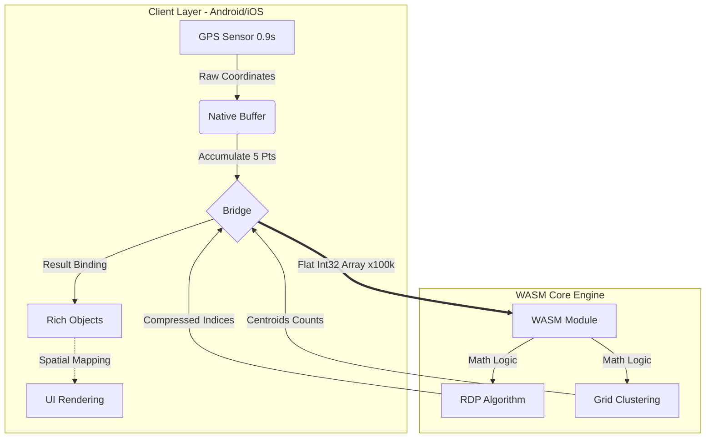

# Core Technology & IP Documentation
## AllToDo Map Engine Architecture

> **Confidential**: This document outlines the proprietary technologies and engineering know-hows integral to the AllToDo Map Engine.

---

## 1. Executive Summary

AllToDo's map engine employs a unique **Hybrid WASM Architecture** that unifies logic across Android and iOS platforms. By leveraging WebAssembly (WASM) for core algorithms and implementing a **Coordinate Quantization (Integer-based Processing)** strategy, we achieve:
*   **Zero-Parity Logic**: 100% identical mathematical behavior on both platforms.
*   **Extreme Performance**: 50% reduction in memory bandwidth and 2x faster arithmetic operations.
*   **Instant Updates**: Hot-swappable logic without app store releases.

---

## 2. Key Intellectual Properties (IP) & Know-How

### 💎 IP-01: Coordinate Quantization Strategy (The "x100,000" Rule)
The most critical optimization in our stack lies in how we handle geospatial data. Instead of standard `Double` (64-bit floating-point) precision, we process all coordinates as `Int32` (32-bit integers).

*   **Implementaion**: `lat/lon * 100,000` -> `Int32`
*   **Engineering Value**:
    1.  **Bitwise Optimization**: Switching from FPU (Floating Point Unit) to ALU (Arithmetic Logic Unit) drastically enables faster CPU instructions for bulk calculations (e.g., RDP distances).
    2.  **Bandwidth Compression**: Reduces memory footprint and data transfer size by **50%** (8 bytes $\to$ 4 bytes per coordinate).
    3.  **Precision-on-Demand**: Retains precision up to **1.1 meters**, which perfectly aligns with the practical requirements of human movement tracking, eliminating wasteful nanometer-level computation.

### 💎 IP-02: Zero-Cost Hybrid Data Binding
A novel approach to Client-WASM communication that bypasses expensive object serialization.

*   **Mechanism**: "Math in WASM, Objects in Client"
*   **Flow**:
    1.  **Client**: Extracts only coordinates into a flat `Int32` array (e.g., `[lat, lon, lat, lon...]`).
    2.  **Bridge**: Transfers purely raw memory to WASM (No JSON, No Classes).
    3.  **WASM**: Performs pure geometric clustering/reduction and returns abstract indices or counts.
    4.  **Client**: Re-maps the mathematical result back to rich `TodoItem` or `UserLog` objects using spatial indexing (Nearest Neighbor).
*   **Value**: Decouples business logic from the math engine, allowing the data structure to evolve independently without breaking the binary compatibility of the WASM module.

### 💎 IP-03: Real-Time High-Frequency Path Compression
A pipeline designed to handle ultra-high frequency GPS data (0.9s interval) without draining battery or storage.

*   **Pipeline**: `OS (0.9s)` $\to$ `Buffer (5 Pts)` $\to$ `WASM RDP` $\to$ `Storage`
*   **Innovation**: Instead of processing the entire path at the end of a session, we perform **Micro-Batch RDP Compression** every 5 points.
*   **Result**:
    *   **Storage Efficiency**: Removes redundant linear points in real-time, reducing DB write operations by up to 80%.
    *   **Memory Safety**: Prevents OOM (Out of Memory) crashes on long-running sessions (e.g., 24h driving), as data is compressed on-the-fly.

---

## 3. Architecture Diagram (Conceptual)

---

## 4. Conclusion
This architecture represents a significant technological barrier to entry for competitors. By moving beyond simple "wrapper" approaches and optimizing at the binary data level (`Int32` quantization), AllToDo secures a unique position in mobile mapping technology with superior performance and maintainability.
