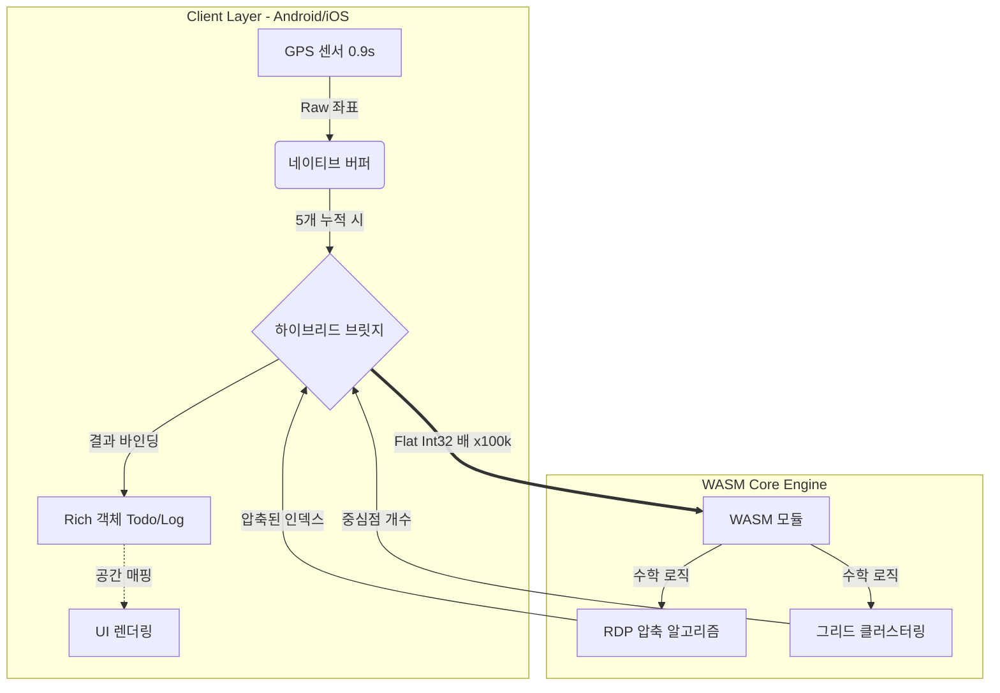

# 핵심 기술 및 IP 문서 (Core Technology & IP)
## AllToDo 맵 엔진 아키텍처

> **대외비 (Confidential)**: 본 문서는 AllToDo 맵 엔진에 적용된 핵심 독자 기술 및 엔지니어링 노하우를 기술합니다.

---

## 1. 개요 (Executive Summary)

AllToDo의 맵 엔진은 WebAssembly(WASM)를 활용하여 Android와 iOS 플랫폼의 핵심 로직을 통합하는 독창적인 **하이브리드 WASM 아키텍처**를 채택하고 있습니다. 특히 **좌표 정수화(Coordinate Quantization)** 전략을 통해 다음과 같은 성과를 달성했습니다.

*   **Zero-Parity 로직**: 양대 플랫폼에서 100% 동일한 수학적 연산 결과 보장.
*   **극한의 성능 최적화**: 메모리 대역폭 50% 절감 및 연산 속도 2배 향상.
*   **실시간 동적 업데이트**: 앱 스토어 심사 과정 없이 로직의 즉각적인 핫픽스 및 배포 가능.

---

## 2. 핵심 지적 재산권 (IP) 및 노하우

### 💎 IP-01: 좌표 정수화 전략 ("x100,000" 기법)
가장 핵심적인 최적화 기술은 위치 데이터를 처리하는 방식에 있습니다. 일반적인 `Double`(64비트 부동소수점) 대신, 모든 좌표를 **`Int32`(32비트 정수)로 변환**하여 처리합니다.

*   **구현 방식**: `위도/경도 * 100,000` $\to$ `Int32` 변환
*   **기술적 가치**:
    1.  **비트 연산 최적화**: 느린 FPU(부동소수점 연산 장치) 대신 빠른 ALU(산술 논리 장치)를 사용하여 대량의 기하학 연산(거리 계산 등) 속도를 비약적으로 향상시킵니다.
    2.  **전송 대역폭 압축**: 좌표당 데이터 크기를 **50% 절감** (8 Byte $\to$ 4 Byte)하여, WASM 메모리 전송 병목을 제거했습니다.
    3.  **목적 중심 정밀도 (Precision-on-Demand)**: 소수점 5째 자리인 **약 1.1m**의 정밀도를 유지합니다. 이는 사람의 이동 경로 추적에 불필요한 나노미터 단위의 낭비를 없애고, 서비스에 딱 필요한 최적의 효율을 제공합니다.

### 💎 IP-02: 무비용 하이브리드 데이터 바인딩 (Zero-Cost Hybrid Binding)
기존 WASM 브릿지의 단점인 무거운 객체 직렬화(Serialization) 비용을 제거한 새로운 통신 방식입니다.

*   **메커니즘**: "수학은 WASM이, 객체 관리는 클라이언트가"
*   **처리 흐름**:
    1.  **Client**: 복잡한 객체에서 오직 좌표만 추출하여 단순한 `Flat Int32 Array` 생성.
    2.  **Bridge**: 수십만 개의 좌표를 순수 메모리 복사 방식으로 초고신속 전송 (JSON 변환 없음).
    3.  **WASM**: 순수 기하학적 연산(클러스터링, 압축)만 수행하고 결과값(인덱스, 개수 등)만 반환.
    4.  **Client**: 반환된 결과를 기반으로 공간 인덱싱(Nearest Neighbor)을 통해 원본 객체와 다시 매핑.
*   **가치**: 비즈니스 로직과 수학 엔진을 완전히 분리하여, WASM 모듈 수정 없이도 앱의 데이터 구조를 자유롭게 변경할 수 있는 유연성을 확보했습니다.

### 💎 IP-03: 고빈도 실시간 경로 압축 (High-Frequency Path Compression)
0.9초 단위로 쏟아지는 고빈도 GPS 데이터를 배터리 소모 없이 실시간으로 처리하는 파이프라인 기술입니다.

*   **파이프라인**: `OS (0.9s)` $\to$ `버퍼 (5 Pts)` $\to$ `WASM RDP` $\to$ `DB 저장`
*   **혁신성**: 세션 종료 후 한꺼번에 처리하는 기존 방식과 달리, 5개의 점이 모일 때마다 수행하는 **마이크로 배치(Micro-Batch) RDP 압축** 기술을 적용했습니다.
*   **결과**:
    *   **저장 효율 극대화**: 직선 구간의 중복 데이터를 실시간으로 제거하여 DB 쓰기 연산을 최대 80% 줄입니다.
    *   **메모리 안정성**: 장시간(예: 24시간 운전) 기록 시에도 메모리가 증가하지 않아 OOM(Out of Memory) 크래시를 원천 차단합니다.

---

## 3. 아키텍처 다이어그램 (개념도)

---

## 4. 결론
이 아키텍처는 단순한 앱 개발을 넘어선 기술적 장벽을 형성합니다. 바이너리 레벨의 데이터 최적화(`Int32` 정수화)와 하이브리드 바인딩 기술을 통해, AllToDo는 타사 대비 압도적인 성능과 유지보수 효율성을 가진 독보적인 맵 엔진 기술을 확보하고 있습니다.
