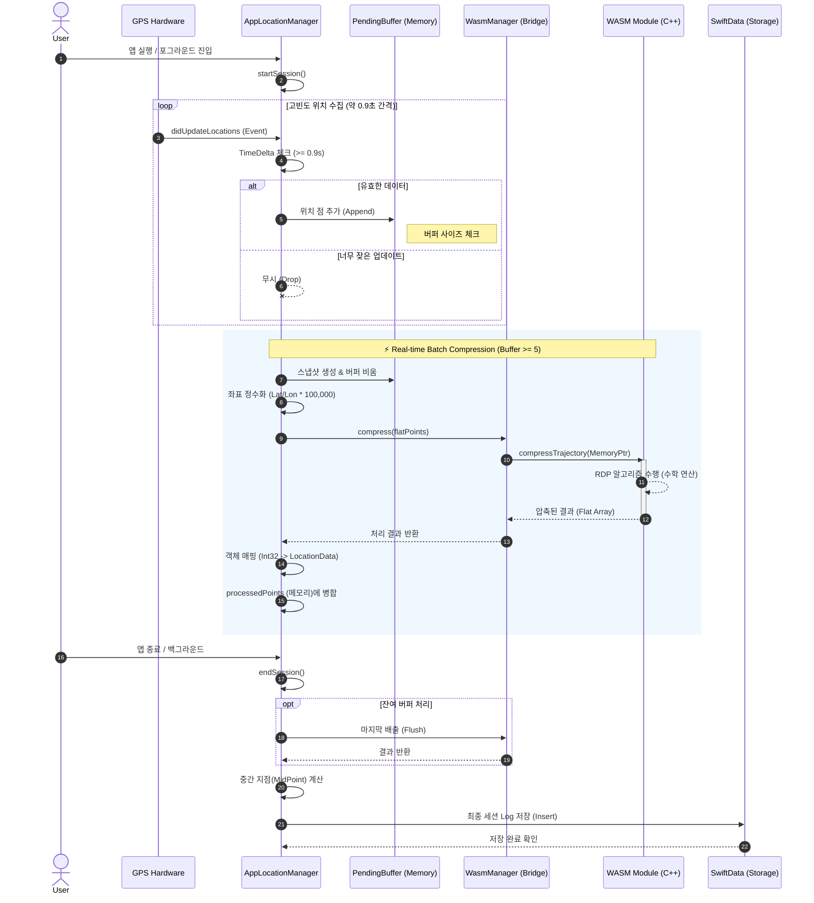

# iOS Location Processing Sequence Diagram

AllToDo iOS 앱의 **위치 수집부터 WASM 압축, 저장까지의 흐름**을 나타내는 시퀀스 다이어그램입니다.

```mermaid
sequenceDiagram
    autonumber
    
    actor User
    participant GPS as GPS Hardware
    participant ALM as AppLocationManager
    participant Buffer as PendingBuffer (Memory)
    participant WASM as WasmManager (Bridge)
    participant Core as WASM Module (C++)
    participant Repo as SwiftData (Storage)

    User->>ALM: 앱 실행 / 포그라운드 진입
    ALM->>ALM: startSession()

    loop 고빈도 위치 수집 (약 0.9초 간격)
        GPS->>ALM: didUpdateLocations (Event)
        ALM->>ALM: TimeDelta 체크 (>= 0.9s)
        
        alt 유효한 데이터
            ALM->>Buffer: 위치 점 추가 (Append)
            Note right of Buffer: 버퍼 사이즈 체크
        else 너무 잦은 업데이트
            ALM--xALM: 무시 (Drop)
        end
    end

    rect rgb(240, 248, 255)
        Note over ALM, Core: ⚡️ Real-time Batch Compression (Buffer >= 5)
        
        ALM->>Buffer: 스냅샷 생성 & 버퍼 비움
        ALM->>ALM: 좌표 정수화 (Lat/Lon * 100,000)
        ALM->>WASM: compress(flatPoints)
        
        WASM->>Core: compressTrajectory(MemoryPtr)
        activate Core
        Core-->>Core: RDP 알고리즘 수행 (수학 연산)
        Core-->>WASM: 압축된 결과 (Flat Array)
        deactivate Core
        
        WASM-->>ALM: 처리 결과 반환
        ALM->>ALM: 객체 매핑 (Int32 -> LocationData)
        ALM->>ALM: processedPoints (메모리)에 병합
    end

    User->>ALM: 앱 종료 / 백그라운드
    ALM->>ALM: endSession()
    
    opt 잔여 버퍼 처리
        ALM->>WASM: 마지막 배출 (Flush)
        WASM-->>ALM: 결과 반환
    end

    ALM->>ALM: 중간 지점(MidPoint) 계산
    ALM->>Repo: 최종 세션 Log 저장 (Insert)
    Repo-->>ALM: 저장 완료 확인
```
