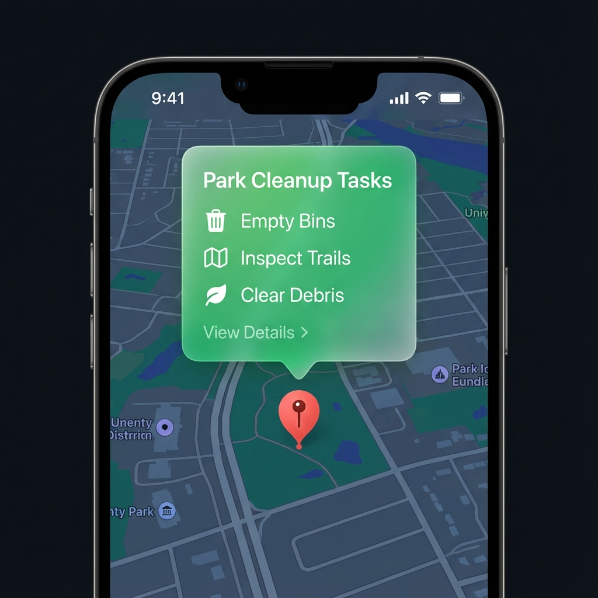

# AllToDo 문서 인덱스 (Documentation Index)

## 🧠 핵심 로직 및 알고리즘 (Core Logic)
*   [**지도 정의 로직 (MAP_DEFINITION_LOGICS)**](logic/map_definition_logics.md)
    *   스마트 트래킹 (Smart Tracking): 위치 업데이트를 위한 최적의 임계값 판정.
    *   앵커 기반 스마트 테더링 (Smart Tethering): 앵커(Anchor) 기준 지도 이탈 방지 및 자유 탐색.
    *   500km 필터링: 원거리 핀에 의한 태평양 줌아웃 방지.
*   [**맵 시작 시퀀스 (Map Begin Logic)**](logic/map_begin_logic.md)
    *   3단계 초기화 로직 (Zoom 15 -> Fit Bounds -> User Zoom 18).
*   [**앱 실행 시나리오 (APP_LAUNCH_SCENARIO)**](logic/APP_LAUNCH_SCENARIO.md)
    *   Case A: 핀 없음 (내 위치 Zoom 15 -> 3초 대기 -> User Zoom 18).
    *   Case B: 핀 있음 (Fit Bounds -> 3초 대기 -> User Zoom 18 및 테더링 활성화).
*   [**핵심 기술 및 IP (CORE_TECHNOLOGY_IP)**](logic/CORE_TECHNOLOGY_IP.md)
    *   WASM 하이브리드 아키텍처.
    *   좌표 정수화 (x100,000) 전략.
    *   RDP 경로 압축 알고리즘.
*   [**할 일 만들기 디자인 및 로직 (Create Todo)**](logic/create_todo.md)
    *   롱터치 위치 기반 할일 핀 및 뷰포트 오프셋.
    *   하단 반투명 레이어 및 스마트 추천(최근 3개) UI.
*   [**데이터베이스 구조 명세서 (DB Schema)**](logic/database_schema.md)
    *   할일, 연락처, 경로 테이블 상세 구조.
    *   [**개체 관계도 (ERD)**](logic/erd.md): 테이블 간의 관계 시각화.
*   [**한글 초성 검색 로직 (Korean Search)**](logic/korean_search.md)
    *   유니코드 기반 초성 추출 및 매칭 알고리즘.
*   **[지식 베이스: 핵심 비즈니스 로직 (KI Core Logic)](/Users/thinking/.gemini/antigravity/knowledge/comprehensive_map_system_guide/artifacts/logic/core_logic.md)** (내부 참조용)

## 🎨 디자인 및 리소스 (Design & Resources)
*   [**맵 핀 디자인 명세서 (MAP_PIN_DESIGN)**](logic/MAP_PIN_DESIGN.md)
    *   핀 색상 규칙 (Red/Green/Blue).
    *   캐싱 전략 및 Parity 검증.
*   [**물풍선(Callout) 디자인 및 로직**](logic/water_balloon_logic.md)
    *   iOS 스타일 파생 프리미엄 오버레이.
    *   자동 중앙 정렬 및 인터랙션 로직.
    *   
*   [**기능 적용 현황표 (FeatureStatus)**](logic/FeatureStatus.md)
    *   Android vs iOS 기능 대조표.

## 🪵 개발 로그 (Logs)
*   [**지도 최적화 로그 (MAP_OPTIMIZATION_LOG)**](history/MAP_OPTIMIZATION_LOG.md)
    *   주요 최적화 작업 이력 (RDP, WASM, Battery).
*   [**작업 로그 (Work Log)**](history/work_log.md)
    *   일일 작업 내역 요약.

## 🗺️ 적용 사례 및 트러블슈팅 (Case Studies)
*   [**안드로이드 스마트 테더링 구현 일지 (Diary)**](plans/android_tethering_diary.md)
    *   플랫폼 간 기능 동기화 및 "개줄 로직" 적용 과정의 UML 및 구현 기록.
*   [**네이버맵 안드로이드 통합 사례 (Case Study)**](plans/NAVER_MAP_ANDROID_CASE_STUDY.md)
    *   빌드 오류, 인증 실패(401, 800), (0,0) 좌표 방어 로직 등 문제 해결 종합 가이드.
*   [**구현 계획 아카이브 (Old Plan)**](plans/NAVER_MAP_ANDROID_INTEGRATION.md)
    *   초기 구현 계획 및 상세 로직 히스토리.

