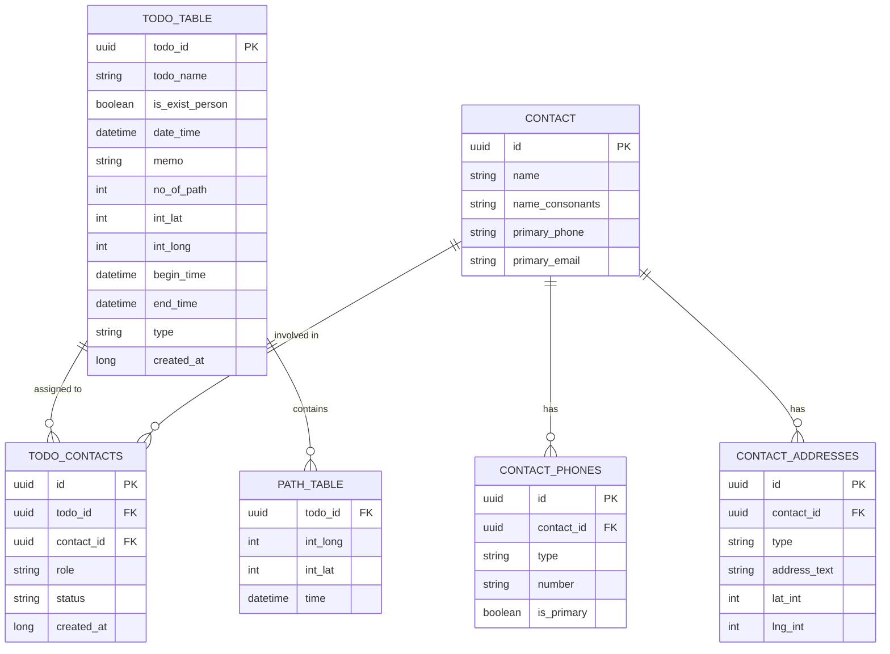

# 개체 관계도 (Entity Relationship Diagram)

AllToDo의 할일, 연락처, 경로 데이터 간의 관계를 시각화한 ERD입니다. 모든 필드명은 `snake_case` 관례를 따릅니다.

## 관계 설명
1.  **할일 : 연락처 (N:M)**
    *   `todo_contacts` 매핑 테이블을 통해 다대다(N:M) 관계를 지원합니다.
    *   하나의 할일에 여러 담당자(owner), 참여자(participant), 관찰자(watcher)를 지정할 수 있습니다.
2.  **연락처 : 상세 정보 (1:N)**
    *   `contact_phones`와 `contact_addresses`를 통해 한 명의 연락처에 여러 개의 전화번호 및 주소(집, 회사 등)를 연결할 수 있습니다.
3.  **할일 : 경로 (1:N)**
    *   히스토리나 경로 데이터가 있는 할일(`no_of_path`가 1 이상인 경우)은 여러 개의 위치 좌표를 가집니다.
