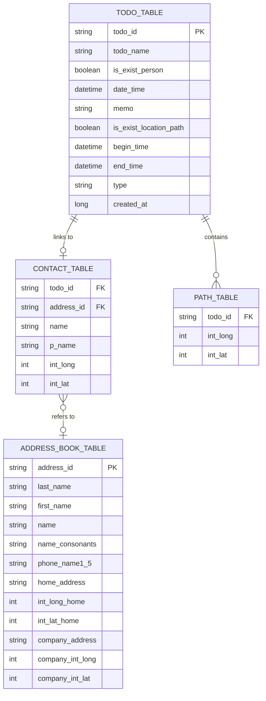

# 개체 관계도 (Entity Relationship Diagram)

AllToDo의 할일, 연락처, 주소록, 경로 데이터 간의 관계를 시각화한 ERD입니다. 모든 필드명은 `snake_case` 관례를 따릅니다.

## 관계 설명
1.  **할일 : 연락처 (1:1 또는 1:0)**
    *   하나의 할일은 하나의 연락처 정보를 가질 수 있습니다 (`is_exist_person`이 true인 경우).
2.  **연락처 : 주소록 (N:1 또는 0:1)**
    *   개별 할일에 할당된 연락처 정보는 시스템 주소록의 특정 항목을 참조할 수 있습니다.
    *   서로 별개의 테이블로 존재하여 데이터의 독립성을 유지합니다.
3.  **할일 : 경로 (1:N)**
    *   히스토리나 경로 데이터가 있는 할일(`is_exist_location_path`가 true인 경우)은 여러 개의 위치 좌표를 가집니다.
