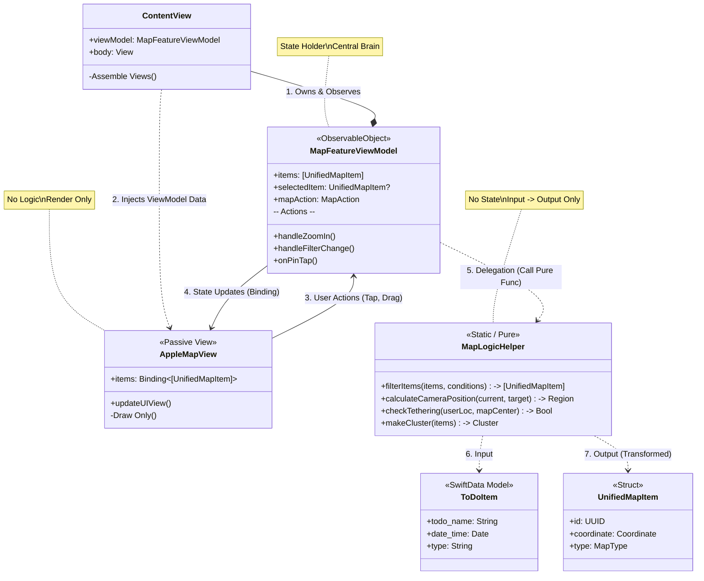

# iOS 아키텍처 구조 조정 및 리팩토링 (Architecture Refactoring)

**목표**: `ContentView`의 비대화와 강한 결합을 해결하기 위해, **MVC 패턴**과 **독립 함수(Functional Core)** 개념을 도입하여 지도 로직을 완전히 분리합니다. 핀 렌더링(Mark) 작업은 구조 안정화 이후로 연기합니다.

## 사용자 리뷰 필요 (User Review Required)
> [!IMPORTANT]
> **핀 로직 보류**: 에셋(Mark) 제작이 선행되어야 하므로, 핀 렌더링 및 필터링 구현은 본 리팩토링 완료 후 진행합니다.

## 현재 상태 (Current Status)
- **Phase 1 (Controller & Logic Helper)**: [완료] `MapFeatureViewModel`, `MapLogicHelper` 구현됨.
- **Phase 2 (Data Flow)**: [완료] `ContentView`의 상태를 ViewModel로 이관 완료.
- **Phase 3 (View Passive-fication)**: [완료] `Apple`, `Kakao`, `Naver`, `Google` MapView 리팩토링 완료. View는 이제 `viewModel.displayItems`를 수동적으로 렌더링함.
- **Phase 4 (Logic & Cleanup)**: [대기] 핀 이미지 로직 구현 및 최종 클린업 예정.

## 변경 제안 (Proposed Changes)

### 1. Controller Layer: `MapFeatureViewModel` [완료]
- **역할**: 지도와 관련된 모든 상태(State)와 액션(Action)을 총괄하는 컨트롤러.
- **구현**:
    - `ObservableObject`로 구현하여 View에 데이터 바인딩 제공.
    - `displayItems`: 거리 기반(500km)으로 필터링된 표시용 아이템 목록 제공.
    - `updateMapItems`: 데이터 변경 시 `MapLogicHelper`를 통해 필터링 및 파티셔닝 수행.

### 2. Functional Core: `MapLogicHelper` (New) [완료]
- **역할**: 상태를 가지지 않는 **독립 함수(Static Functions)**들의 집합.
- **기능**:
    - `filterAndTransformItems`: 시간 및 경로 유무에 따른 1차 필터링.
    - `partitionItemsByDistance`: 사용자 위치 기준 500km 원거리/근거리 분리 로직.
    - `distance`: 거리 계산 헬퍼.

### 3. View Layer: Passive Views [완료]
- **대상**: `AppleMapView`, `KakaoMapView`, `NaverMapView`, `GoogleMapView`
- **변경**:
    - 내부의 복잡한 "Far Items" 필터링 루프 제거.
    - `onFarItemsDetected` 콜백 제거 (ViewModel이 상태 관리).
    - `viewModel.displayItems`를 그대로 렌더링하도록 단순화.

### 4. Integration: `ContentView` Cleanup [진행 중]
- **작업**:
    - `MapFeatureViewModel` 인스턴스 생성 및 주입.
    - 700라인에 달하는 코드 중 지도 관련 로직을 모두 ViewModel 및 Helper로 이관.
    - 레이아웃 구성 역할에만 집중.

### 5. 아키텍처 다이어그램 (Architectural Diagram - UML)
새로운 구조인 **MVC + Functional Core**의 관계도입니다. `MapFeatureViewModel`이 중심에서 상태를 관리하고, 계산 로직은 `MapLogicHelper`로 완전히 위임하며, View는 철저히 수동적(Passive)으로 동작합니다.

---

### 3. 데이터 모델 통합 (Data Model Integration)
#### [MODIFY] [UnifiedMapModels.swift](file:///Volumes/Work/AllToDo/AllToDo-iOS/AllToDo/Models/UnifiedMapModels.swift)
- **`ToDoItem` 확장**:
    - `no_of_path` (Int): 임시 필드 추가 (기본값 0).
    - `int_long`, `int_lat` (Int): 등시 필드 추가.
- **`UnifiedMapItem` 로직 개선**:
    - `imageName` 연산 프로퍼티가 더 이상 하드코딩된 문자열("PinTodoReady")이 아닌, `item.type`을 반환하도록 수정. -> `PinImageHelper`가 이를 해석.

### 4. 필터링 로직 (Filtering Logic)
#### [MODIFY] `MapViewModel.swift` (or equivalent provider)
- **5대 필터링 규칙 구현**:
    1.  `no_of_path == 0` 체크.
    2.  `date_time` ±24시간 체크.
    3.  Korea Region Partitioning (카카오/네이버 한정).
    4.  Distance Filter 제거 (Apple/Google은 전 세계 표시).
    5.  `type == "00"` (현재 위치) 예외 처리.
    > 자세한 규칙은 `docs/logic/cross_platform_map_rules.md`를 참조하세요.

### 5. 현재 위치 Todo화 (Current Location as Todo)
#### [NEW] `CurrentLocationManager.swift`
- **역할**: "현재 위치"를 `Type 00` TodoItem으로 관리하는 싱글톤 매니저.
- **기능**:
    - `currentTodo`: 실시간 좌표가 업데이트되는 가상의 Todo 객체 제공.
    - 앱 종료 시 이 객체를 `Type 01` (History)로 변환하여 저장하는 로직(Mock) 구현.
### 6. 현재 위치 최적화 (Current Location Optimization) - [New]
- **문제**: 현재 위치 이동 시 전체 핀이 다시 그려지며 깜빡임 발생.
- **해결 방안 (Visual Diffing)**:
    - 거리 제한(50m) 로직을 폐기하고, 모든 위치 변경을 View로 전달.
    - **View Level Diffing**: `AppleMapView`에서 새로운 클러스터링 결과와 기존 핀들을 비교.
    - **핀 재사용(Reuse)**: '내 위치' 핀의 구성(단독/클러스터 여부)이 이전과 같다면, 핀을 지우고 다시 만드는 대신 **기존 핀 객체를 재사용하여 좌표만 애니메이션(`UIView.animate`)으로 부드럽게 이동**.
    - 구성이 달라질 때(예: 클러스터 합류/이탈)만 핀을 교체하여 자연스러운 전환 구현.

## 검증 계획 (Verification Plan)
### 자동화 테스트 (Automated Tests)
- `PinImageHelperTests`: `type` 문자열 입력 시 올바른 이미지(Shield+Mark 합성)가 생성되는지 검증.
- `FilterLogicTests`: 다양한 조건(시간, 거리, 지역)의 Todo 핀들이 필터링 로직을 통과하는지/제외되는지 단위 테스트.

### 수동 검증 (Manual Verification)
- **시뮬레이터/단말기 테스트**: 
    - 지도 상에 내 위치가 `Red Shield` 핀으로 표시되는지 확인.
    - 다양한 `Type`의 핀이 올바른 색상과 마크로 렌더링되는지 확인.
    - 한국 외부 좌표로 설정 시 카카오맵에서 핀이 사라지는지 확인.
