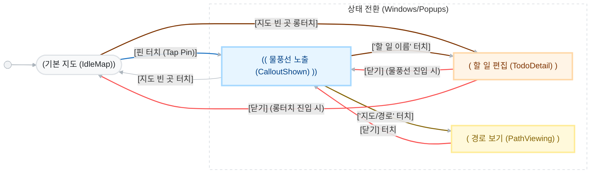
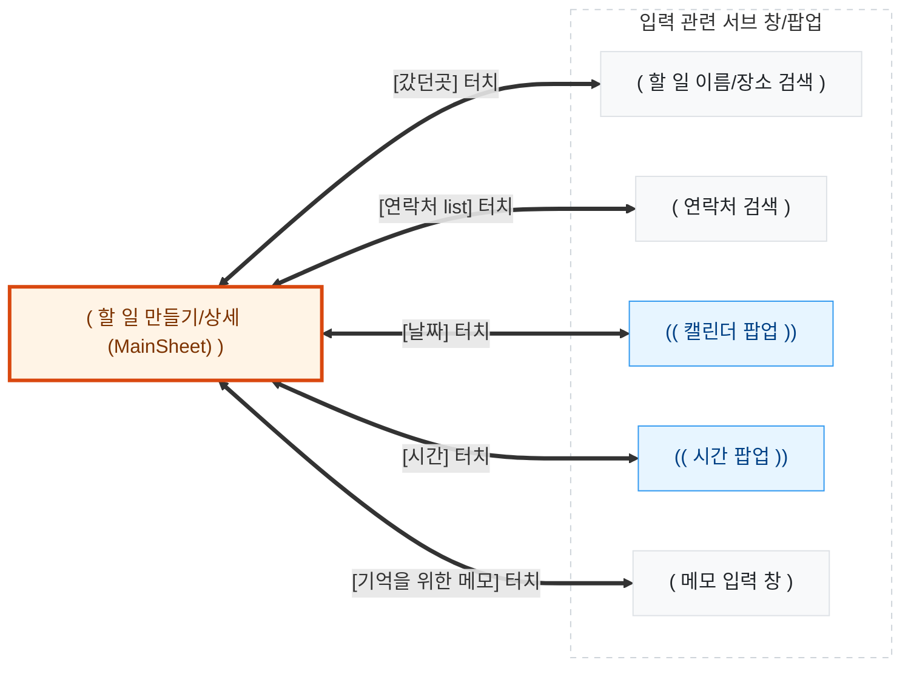

# AllToDo Interaction Flow Definitions (State Diagram)

앱의 '상태' 전환을 명확히 규합하여 지시 없는 수정을 제지하는 설계도로 활용합니다.

## 기본 지도
"핀 선택 -> 물풍선 -> 할 일/경로 진입"으로 이어지는 앱의 각 상태와 전환 조건(Trigger)을 정의합니다.

## 다이어그램을 통한 "수정 제제" 규약
- **상태 전이 준수**: 위 화살표에 정의되지 않은 방식으로 화면이 넘어가거나(예: 핀 터치 시 물풍선 없이 바로 상세창 이동), 임의의 중간 상태를 추가하는 행위는 사용자님의 승인 없이 수행하지 않습니다.
- **Trigger 확인**: 각 화살표에 적힌 '터치 조건'만이 유일한 상태 변경 트리거임을 보장합니다.

---

## 할 일 편집 (Todo Detail Inputs)
할 일의 각 필드를 입력하기 위해 진입하는 서브 창들과의 전환 로직입니다.

