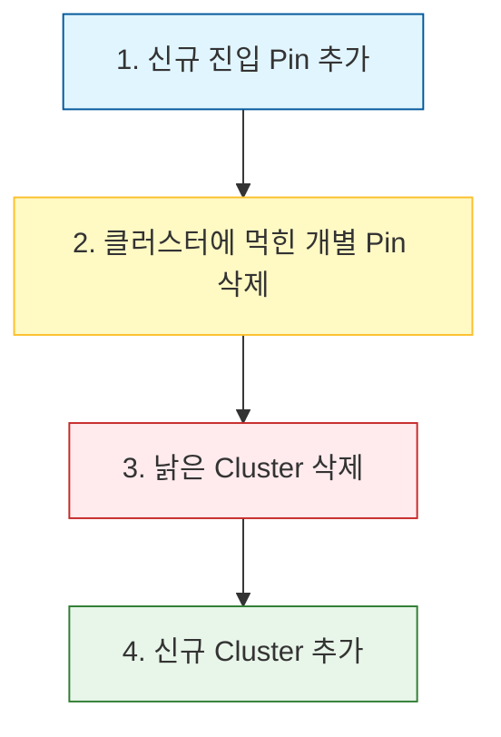

# AllToDo 통합 지도 클러스터링 로직 (Unified Map Logics)

이 문서는 AllToDo 프로젝트의 고성능 지도 클러스터링 시스템을 지탱하는 핵심 수치 연산 및 UX 원칙을 상세히 기술합니다. 시간이 지나도 로직의 설계 의도(Design Intent)를 명확히 파악할 수 있도록 돕는 것을 목적으로 합니다.

---

## 1. 핵심 철학: Wm (ScreenWidthMeters) 기반 동적 반경
> [!NOTE]
> 왜 줌 레벨(Zoom Level)을 직접 사용하지 않는가?

*   **문제점**: 지도 엔진마다(Apple, Google, Naver) 줌 레벨의 정의가 미세하게 다르고, 같은 줌이라도 위도(Latitude)에 따라 실제로 화면에 보이는 거리(m)가 왜곡됩니다.
*   **해결책**: 사용자의 눈에 보이는 **"화면 가로폭에 담긴 실제 미터 거리(Wm)"**를 기준으로 삼습니다.
    *   이를 통해 모든 엔진에서 시각적으로 **동일한 밀도의 클러스터링**을 보장합니다.
    *   줌을 확대하면 Wm이 작아지고, 축소하면 Wm이 커지는 반비례 관계를 활용합니다.

---

## 2. metersPerPixel 표준 계산법 (Pixel Sampling)
> [!TIP]
> 지도의 회전(Rotation)과 기울기(Tilt)에도 무너지지 않는 가장 정교한 방식입니다.

과거에는 `156543 * cos(lat) / 2^zoom` 같은 근사식을 썼으나, 이는 지도가 기울어지면(Tilt) 맞지 않습니다. AllToDo는 **실측 샘플링** 방식을 채택합니다.

### 계산 절차
1.  **샘플링**: 화면 정중앙 가로선상의 양 끝 픽셀 좌표를 잡습니다.
    -   좌측 끝: `(0, H/2)`
    -   우측 끝: `(W, H/2)`
2.  **역투영(Unprojection)**: 각 지도 엔진의 `Projection` 도구를 이용해 이를 실제 위경도로 변환합니다.
3.  **거리 측정**: 두 위경도 사이의 물리적 거리(m)를 측정합니다.
4.  **산출**: `metersPerPixel = distance / screenWidthPx`

### 왜 이 방식인가?
-   지도가 회전되거나 틸트되어 있어도, 엔진의 `Projection`은 이미 그 모든 왜곡을 계산에 넣고 있습니다. 따라서 우리는 단순히 **"1픽셀이 지상에서 몇 미터인지"**를 가장 정확한 팩트로 얻을 수 있습니다.

---

## 3. 나눗셈 배제 원칙 (No-Division Principle)
> [!IMPORTANT]
> 60FPS를 유지해야 하는 지도 렌더링 루프에서 부동 소수점 나눗셈은 치명적입니다.

### 수치 최적화의 근거
-   **CPU 부하**: `DIV`(나눗셈) 명령어는 `MUL`(곱셈) 대비 약 **10~40배** 긴 CPU 사이클을 소모합니다. 
-   **안정성**: 나눗셈 시 발생하는 정밀도 손실이나 `Divide by Zero` 에러를 원천 봉쇄합니다.

### 1.5배 임계값(Threshold) 공식 유도
우리는 화면 가로폭 `Wm1`이 이전 시점 `Wm0` 대비 1.5배 이상 변했을 때만 재계산하고 싶습니다.

1.  **기본식 (나눗셈 버전)**: `ratio = Wm1 / Wm0`, 만약 `ratio > 1.5` 거나 `ratio < 0.66` 이면 재계산.
2.  **변환식 (곱셈 버전)**:
    -   **축소(Zoom-Out)**: `Wm1 >= 1.5 * Wm0`  $\rightarrow$  `Wm1 >= (3/2) * Wm0`  $\rightarrow$  **`2 * Wm1 >= 3 * Wm0`**
    -   **확대(Zoom-In)**: `Wm1 <= 0.66 * Wm0`  $\rightarrow$  `Wm1 <= (2/3) * Wm0`  $\rightarrow$  **`3 * Wm1 <= 2 * Wm0`**

`shouldRecluster = (2 * Wm1 >= 3 * Wm0) || (3 * Wm1 <= 2 * Wm0)`
이 수식은 모든 지도 엔진의 `refreshWasmClusters`에서 초당 수십 번 호출되어도 부하가 거의 없습니다.

---

## 4. 4단계 스무딩 (4-Step Smoothing Process)
> [!CAUTION]
> 핀들이 한꺼번에 사라졌다가 나타나는 '깜빡임(Flickering)'은 사용자 신뢰를 떨어뜨립니다.

계산된 좌표를 화면에 그릴 때, `UIView`나 `Composable`을 한꺼번에 비우지 않고 아래의 순서를 지킵니다.

1.  **Pin Add First**: 새로 생긴 단독 핀을 먼저 그립니다. (심리적 반응성 증대)
2.  **Cleanup Overlaps**: 이제 클러스터로 뭉쳐져서 필요 없어진 핀들을 조용히 뺍니다.
3.  **Old Cluster Removal**: 줌 레벨이 바뀌어 위치가 달라진 옛날 클러스터를 제거합니다.
4.  **New Cluster Addition**: 최종적으로 새로운 클러스터를 그 자리에 배치합니다.

이 순서를 지키면 핀들이 **부드럽게 합쳐지거나(Merge) 찢어지는(Split)** 듯한 시무딩 효과를 얻게 됩니다.

---

## 5. 결정론적 정렬 (Deterministic Sorting)
> [!NOTE]
> 왜 Rust(WASM) 내부에서 정렬을 수행하는가?

입력 데이터(`allItems`)의 순서가 서버 응답이나 DB 로드 순서에 따라 매번 달라질 수 있습니다. 만약 입력 순서가 달라졌다고 클러스터 모양이 바뀐다면 핀들이 "벌벌 떨리는" 현상이 발생합니다.

-   **해결**: `lib.rs`의 `cluster()` 함수는 입력받은 포인트들을 **[위도, 경도]** 순으로 즉시 정렬합니다.
-   **결과**: 입력 리스트의 순서가 어떻게 들어오든, 물리적 위치가 같다면 **항상 동일한 클러스터 결과**를 뱉어내어 시각적 안정성을 확보합니다.

---

## 6. 실시간 항목 업데이트 예외 정책 (Bypass Policy)
> [!TIP]
> 줌 레벨은 그대로인데 사용자 위치만 바뀔 때 핀이 멈춰 보이는 현상을 방지합니다.

-   **핵심**: 위에서 언급한 1.5x 임계값 로직은 **지도 조작** 시의 부하를 줄이기 위한 것입니다. 하지만 **항목 자체의 데이터(사용자 위치 등)가 변한 경우**에는 임계값에 도달하지 않았더라도 클러스터링 결과가 달라져야 합니다.
-   **규칙**: 데이터 변경 스냅샷이 달라지거나, 위치 서비스에서 유의미한 이동을 보고하면 줌 임계값을 무시하고 즉시 `force: true`로 재클러스터링을 강제합니다.

---

## 7. 이동 임계값 필터링 (SmartLocationManager)
항목 데이터 업데이트 시에도 무분별한 재클러스터링을 방지하기 위해 `SmartLocationManager`가 이동 거리를 정수화하여 검사합니다.

-   **공식**: `Threshold = max(2, currentSpan * 200)`
-   **의미**: 지도의 화면 위경도 폭(Span)에 200을 곱한 값을 정수 임계값으로 삼습니다. 
    *   **고배율(Zoom-In)**: 약 2.2m~5m 이동 시 업데이트.
    *   **저배율(Zoom-Out)**: 약 100m~500m 이동 시 업데이트.

---

## 8. 권고 패턴: 카카오 스타일 (Identity Persistence Strategy)
> [!IMPORTANT]
> 핀을 지우고 새로 그리는 대신, '정체성(ID)'을 유지하며 부드럽게 이동시킵니다.

'카카오 스타일'은 사용자 위치와 같이 매 프레임 위치가 변하는 초동역적 데이터를 처리하는 가장 고도화된 방식입니다.

### 8.1. 주요 원칙
1.  **Stable ID (고정 정체성)**: 클러스터링 결과와 관계없이 사용자 위치 항목에는 상수로 정의된 고정 ID(`UserPoi` 또는 `000...000` UUID)를 부여합니다.
2.  **Lookup & Reuse (조회 및 재사용)**: 렌더링 루프에서 마커를 새로 생성하기 전에, 고정 ID를 가진 기존 마커가 맵 상에 존재하는지 먼저 확인합니다.
3.  **In-place Mutation (현장 수정)**: 기존 마커가 발견되면 이를 삭제(Remove)하지 않고, 좌표(`position`)와 스타일(`icon`)만 직접 수정합니다.
4.  **Smooth Animation (부드러운 이동)**: 좌표 업데이트 시 플랫폼별 애니메이션 API를 연동하여 0.2~0.3초간 미끄러지듯 이동시킵니다.

### 8.2. 구현 효과
-   **깜빡임 차단**: 객체를 파괴하지 않으므로 시각적 단절이 없습니다.
-   **연속성 보장**: 사용자가 단독 핀에서 클러스터로 병합되거나 빠져나올 때도 동일한 마커 인스턴스가 아이콘만 '변신'하며 유지됩니다.
-   **성능 최적화**: 매번 비트맵을 생성하고 뷰 계층에 추가하는 오버헤드를 줄입니다.

---
*Last Updated: 2026-01-07 (Added Kakao Style Detail)*
