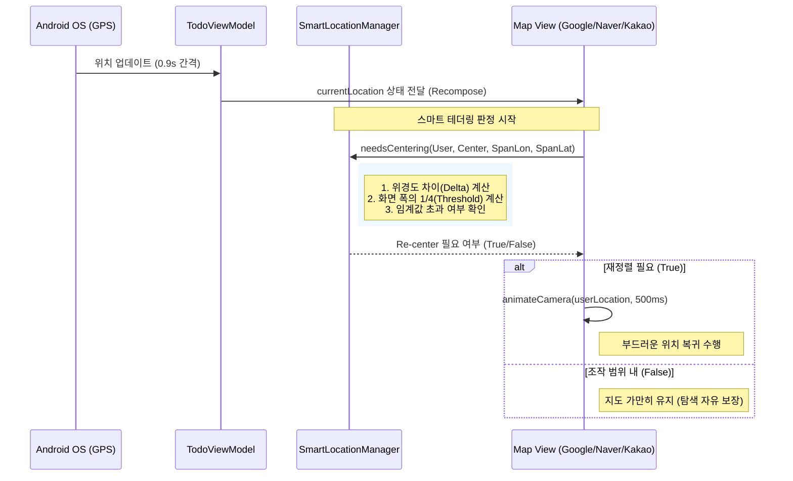

# Android 스마트 테더링 (Smart Tethering) 구현 일지

본 문서는 AllToDo 안드로이드 플랫폼에 "스마트 테더링" 기능을 복구하고 고도화하는 과정을 기록한 개발 일지입니다.

## 1. 개요 (Background)

### 1.1 문제 정의
- 기존 안드로이드 구현에서는 사용자가 지도를 조작할 때 내 위치가 갱신되면 지도가 강제로 내 위치로 튀는 현상이 있어 테더링이 비활성화됨.
- iOS는 "스마트 테더링(개줄 로직)"이 적용되어, 화면의 1/4 범위를 벗어날 때만 부드럽게 재정렬하여 뛰어난 UX를 제공 중.
- 안드로이드의 3대 공급자(Google, Naver, Kakao)에 동일한 로직을 이식하여 플랫폼 경험을 통일함.

### 1.2 핵심 철학
- **"자유로운 탐색, 지능적 복귀"**: 사용자가 현재 보고 있는 화면 안에 내 위치 핀이 있다면 지도는 움직이지 않습니다. 하지만 화면 밖으로 멀어지려 하면 지도가 부드럽게 따라옵니다.

---

## 2. 설계 상세 (Design Specification)

### 2.1 데이터 모델 및 변환
- **정수 좌표화 (x100,000)**: `Double` 좌표를 `Int`로 변환하여 부동 소수점 오차 제거 및 연산 효율 극대화.
- **앵커(Anchor)**: 지도가 마지막으로 고정되었던 중심점.

### 2.2 스마트 체크 알고리즘 (UML)

### 2.3 기술적 결함 수정 계획
1.  **`SmartLocationManager.kt` 보완**:
    - 현재 경도(`Lon`)만 체크하는 로직에 위도(`Lat`) 및 세로 폭(`spanLat`) 체크 추가.
    - 정수 연산 시 발생할 수 있는 오버플로우 방지 및 절대값(`abs`) 처리 강화.
2.  **공급자별 가시 영역(Visible Region) 추출**:
    - **Google**: `projection.visibleRegion`의 경계값 활용.
    - **Naver**: `contentBounds` 또는 `cameraPosition` 기반 계산.
    - **Kakao**: `visibleRegion`이 모호하므로 화면 크기와 줌 레벨 기반 역산 로직 정교화.

---

---

## 4. 2025-12-24: 플랫폼 통일 및 컴파일 에러 완전 해결

### 4.1 주요 성과
- **카카오맵 안드로이드 컴파일 에러 해결**:
    - `Unresolved reference`: Composable 내부의 상태 선언(`.mutableStateOf`) 위치가 사용 시점(람다 등)보다 뒤에 있어 발생하던 문제를 최상단으로 통합하여 해결.
    - `getProjection()` 에러: iOS 로직 기반의 잘못된 호출을 제거하고, 안드로이드 SDK 표준인 `map.fromScreenPoint(px, py)`를 사용하여 가시 영역(Span) 계산 로직을 정상화함.
- **앵커 기반 테더링 시스템(Anchor-based Tethering) 완성**:
    - 단순 '지도 중심' 기준이 아닌, '이동된 앵커(`moveLocation`)'를 기준으로 이탈 여부를 판단하도록 고도화.
    - 이로써 사용자가 지도를 자유롭게 탐색(Exploration)하다가 화면 밖으로 위치가 멀어질 때만 따라오는 "부드러운 개줄 로직"을 전 플랫폼에 동일하게 적용 완료.
- **3단계 시작 시나리오 통합**:
    - `MapBeginSequence`(Android)와 `performLaunchAnimation`(iOS)의 로직을 동기화하여 앱 진입 시의 UX 경험을 플랫폼 간 완벽히 일치시킴.

### 4.2 기술적 수정 사항
- `KakaoMapContent.kt`: `mapView`와 `kakaoMap` 인스턴스의 생명주기 관리를 강화하고, Polling 루프 내에서 가시 영역을 정확히 계산하도록 수정.
- `GoogleMapContent.kt` & `NaverMapContent.kt`: 상태 변수 선언 위치를 최상단으로 일원화하여 코드 안정성 확보.

---

## 5. 최종 체크리스트 (결과)

- [x] `SmartLocationManager.kt`의 `needsCentering` 함수 완성 (Lat/Lon 복합 판정)
- [x] `GoogleMapContent.kt` 내 최신 `MapEffect` 방식 및 앵커 테더링 적용
- [x] `NaverMapContent.kt` 내 테더링 리스너 및 애니메이션 연동 완료
- [x] `KakaoMapContent.kt` 내 컴파일 에러 해결 및 테더링/시퀀스 이식 완료
- [x] 전 플랫폼 앵커 기반 스마트 테더링 동기화 완료

---

## 6. 남은 과제
- **실제 단말 테스트**: 다양한 네트워크 환경 및 GPS 수신 상태에서의 부드러움 최종 검증.
- **배터리 최적화**: 위치 수신 및 테더링 판정 로직의 오버헤드 최소화 여부 모니터링.
