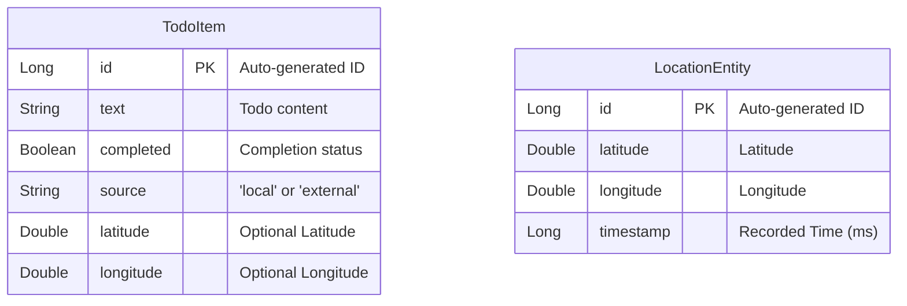

# AllToDo Entity Relationship Diagram (ERD)

## Description
*   **TodoItem**: Represents a task. It can optionally have a location (`latitude`, `longitude`) but is not strictly linked to [LocationEntity](file:///Volumes/Work/AllToDo/AllToDo-Android/app/src/main/java/com/example/alltodo/data/LocationEntity.kt#6-13) by a foreign key.
*   **LocationEntity**: Represents a point in the user's location history track, recorded automatically.
